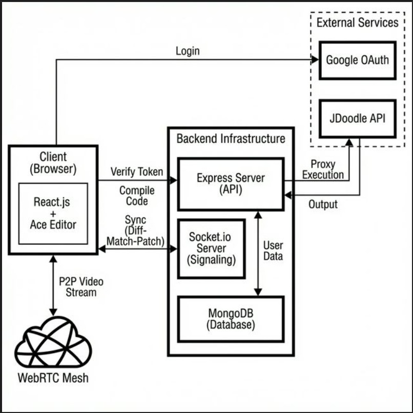

# CodeCast

CodeCast is a real-time collaborative coding platform for pair programming, technical interviews, and remote mentoring. It combines a live code editor, video/audio chat, and a shared whiteboard in one workspace.

## Features

- Real-time collaborative code editing
- Video and audio chat via WebRTC
- Shared whiteboard collaboration
- Multi-language code execution support
- Room-based sessions with authentication

## Tech Stack

### Frontend
- React
- TypeScript
- Material UI
- Ace Editor
- Socket.IO Client
- Simple-Peer (WebRTC)
- Fabric.js
- Axios

### Backend
- Node.js
- Express.js
- Socket.IO
- MongoDB + Mongoose
- JWT + Bcrypt
- JDoodle API integration

## Architecture



For implementation details, see [ARCHITECTURE.md](./ARCHITECTURE.md).

## Project Structure

```text
CodeCast/
├── Code-Cast-backend/        # Node/Express backend
│   └── src/
├── Code-Cast-frontend/       # React + TypeScript frontend
│   └── src/
├── ARCHITECTURE.md
├── architecture_flow.png
└── README.md
```

## Local Setup

### Prerequisites
- Node.js (v14+)
- MongoDB (local instance or Atlas)
- JDoodle API credentials (for code execution)

### 1) Clone and install

```bash
git clone <repository-url>
cd CodeCast
```

### 2) Backend setup

```bash
cd Code-Cast-backend
npm install
```

Create `.env` in `Code-Cast-backend`:

```env
PORT=8080
mongo_url=your_mongodb_connection_string
JWT_SECRET=your_jwt_secret
BASE_URL=http://localhost:8080

CLIENT_ID=your_jdoodle_client_id
CLIENT_SECRET=your_jdoodle_client_secret

# Optional
GMAIL_EMAIL=your_email@gmail.com
GMAIL_PASSWORD=your_email_app_password
```

Run backend:

```bash
npm start
# or
npm run dev
```

### 3) Frontend setup (TypeScript)

```bash
cd ../Code-Cast-frontend
npm install
npm start
```

App runs at `http://localhost:3000`.

## Configuration Note

If API URLs are hardcoded for a deployed backend, replace them with your local backend URL (`http://localhost:8080`) in frontend files such as:

- `Code-Cast-frontend/src/Components/Login.tsx`
- `Code-Cast-frontend/src/Room/CodeEditor.tsx`

## Contributing

1. Fork the repository
2. Create a feature branch
3. Commit your changes
4. Push and open a pull request
